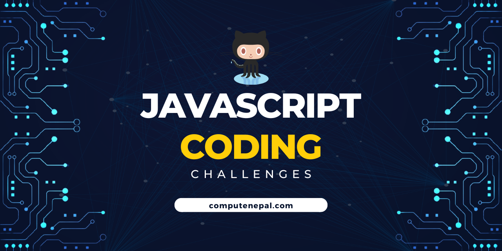

# JS Coding Challenges

[](https://github.com/ComputeNepal/js-coding-challenges "Go to GitHub repo")
[](https://github.com/ComputeNepal/js-coding-challenges)
[](https://github.com/ComputeNepal/js-coding-challenges)

[](#license)
[](https://github.com/ComputeNepal/js-coding-challenges/issues)

[](/CONTRIBUTING.md "Go to contributions doc")



This repository contains a collection of JavaScript coding challenges that are designed to help you improve your skills and test your knowledge of the language. Each challenge is accompanied by a README file that explains the problem statement, input/output, and any additional requirements.

The answers will be available in /solutions/problem_title/answer.js while the explanation will be given in /solutions/problem_title/readme.md.

Make sure to star the repository if you find it useful. And contributions to the repository are welcome.

## Resources

Before moving forward, if you are an complete beginner and don't know anything about programming or JavaScript, you may want to look at the following resources:

- [Resources](./Resources/Resources.md)
- [Roadmap](./Resources/Roadmap.md)

## Challenge 1: FizzBuzz

Write a program that prints the numbers from 1 to 100. But for multiples of three, print "Fizz" instead of the number and for the multiples of five, print "Buzz". For numbers which are multiples of both three and five, print "FizzBuzz". For example, your program should print:

```javascript
1
2
Fizz
4
Buzz
Fizz
7
8
Fizz
Buzz
11
Fizz
13
14
FizzBuzz
16
...
```

[Solution Explanation](./solutions/ch_1_FizzBuzz/readme.md)

## Challenge 2: Palindrome Checker

Create a function that takes a string as an argument and returns `true` if it's a palindrome and `false` if it's not. A palindrome is a word, phrase, number, or other sequence of characters that reads the same forward and backward. For example, "racecar" is a palindrome, but "hello" is not.

[Solution Explanation](./solutions/ch_2_Palindrome_Checker/readme.md)

## Challenge 3: Fibonacci Series

Write a function that takes a number `n` as input and returns the first `n` numbers in the Fibonacci sequence. The Fibonacci sequence is a series of numbers in which each number is the sum of the two preceding numbers. The first two numbers in the sequence are 0 and 1. For example, if `n` is 5, the function should return the array` [0, 1, 1, 2, 3]`.

[Solution Explanation](./solutions/ch_3_Fibonacci_Series/readme.md)

## Challenge 4: Find the Longest Word

Write a function that takes a string and returns the longest word in the string. If there are two or more words that are of the same length, return the first one that appears in the string. For example, if the input string is "The quick brown fox jumps over the lazy dog", the function should return "quick".

[Solution Explanation](./solutions/ch_4_Longest_Word/readme.md)

## Challenge 5: Reverse a String

Write a function that takes a string as input and returns the string reversed. For example, if the input string is "hello", the function should return "olleh".

[Solution Explanation](./solutions/ch_5_Reverse_String/readme.md)

## Challenge 6: Capitalize the First Letter of Each Word

Write a function that takes a string as input and returns the string with the first letter of each word capitalized. For example, if the input string is "the quick brown fox", the function should return "The Quick Brown Fox".

[Solution Explanation](./solutions/ch_6_Capitalize_First_Letter_of_Word/readme.md)

## Challenge 7: Check for Prime Numbers

Write a function that takes a number as input and returns `true` if it's a prime number and `false` if it's not. A prime number is a natural number greater than 1 that is not a product of two smaller natural numbers. For example, 2, 3, 5, 7, 11, and 13 are prime numbers, but 4, 6, 8, and 9 are not.

[Solution Explanation](./solutions/ch_7_Prime_Numbers/readme.md)

## Challenge 8: Sum of Digits

Write a function that takes a number as input and returns the sum of its digits. For example, if the input number is 123, the function should return 6 (1 + 2 + 3 = 6).

[Solution Explanation](./solutions/ch_8_Sum_of_Digits/readme.md)

## Challenge 9: Title Case a Sentence

Write a function that takes a string as input and returns the string with the first letter of each word capitalized. For example, if the input string is "the quick brown fox", the function should return "The Quick Brown Fox". Note that the function should capitalize the first letter of every word, even if it's a small word like "and" or "the".

[Solution Explanation](./solutions/ch_9_Title_Case_Sentence/readme.md)

## Challenge 10: Find the Factorial of a Number

Write a function that takes a number as input and returns its factorial. The factorial of a number is the product of all positive integers from 1 to the number itself. For example, the factorial of 5 is 120 (1 _ 2 _ 3 _ 4 _ 5 = 120).

Write a function called `factorial` that takes a number as its parameter and returns its factorial. If the input number is 0, the function should return 1.

[Solution Explanation](./solutions/ch_10_Factorial_of_Number/readme.md)

## Challenge 11: Find the Second Largest Number

Write a function that takes an array of numbers as input and returns the second largest number in the array. For example, if the input array is [5, 10, 7, 2, 1], the function should return 7.

Write a function called `secondLargest` that takes an array of numbers as its parameter and returns the second largest number in the array.

[Solution Explanation](./solutions/ch_11_Second_Largest_Number/readme.md)

## Challenge 12: Find the Smallest Common Multiple

Write a function that takes two numbers as input and returns the smallest common multiple of those numbers. The smallest common multiple is the smallest number that is divisible by both of the input numbers. For example, the smallest common multiple of 3 and 4 is 12.

Write a function called `smallestCommonMultiple` that takes two numbers as its parameters and returns the smallest common multiple of those numbers.

[Solution Explanation](./solutions/ch_12_Smallest_Common_Multiple/readme.md)

## Challenge 13: Remove Duplicates from an Array

Write a function that takes an array as input and returns a new array with all duplicate elements removed. For example, if the input array is [1, 2, 2, 3, 4, 4, 5], the function should return [1, 2, 3, 4, 5].

Write a function called `removeDuplicates` that takes an array as its parameter and returns a new array with all duplicate elements removed.

[Solution Explanation](./solutions/ch_13_Remove_Duplicate_From_Array/readme.md)

## Challenge 14: Find the Maximum Subarray Sum (Kadane's Algorithm)

Write a function that takes an array as input and returns the Maximum subarray sum. Subarrays are arrays inside another array which only contains contiguous elements. For example, if the array is [-3, -4, 5, -1, 2, -4, 6, -1], the function should return 8 since subarray [5, -1, 2, -4, 6] is the max sum contiguous subarray with sum 8.

Write a function `MaxSubArraySum` that takes an array as its parameter and returns the maximum subarray sum.

[Solution Explanation](./solutions/ch_14_Max_Subarray_Sum/readme.md)

## Challenge 15: Swap two numbers

Write a function that takes two numbers as input and swaps the numbers. For example if inputs are num_1 = 5 and num_2 = 10 the function should return num_1 = 10 and num_2 = 5

Write a function `swap` that takes two integers as its parameter and swaps them.

[Solution Explanation](./solutions/ch_15_Swap_Numbers/readme.md)

## Challenge 16: Convert Celsius to Fahrenheit

Write a function that takes a temperature in Celsius as input and returns the equivalent temperature in Fahrenheit. The formula for converting Celsius to Fahrenheit is F = (C \* 1.8) + 32.

Write a function called `celsiusToFahrenheit` that takes a temperature in Celsius as its parameter and returns the equivalent temperature in Fahrenheit.

[Solution Explanation](./solutions/ch_16_Celsius_To_Fahrenheit/readme.md)

## Challenge 17: Calculate the Sum of N Natural Number

Write a function that takes a number as input and returns sum from 1 to `n`. For example, if the input is 10, the function should return 55.

Write a function called `getNaturalSum` that takes a number `n` as its parameter and returns sum of natural number.

[Solution Explanation](./solutions/ch_17_Sum_Of_N_Natural_Number/readme.md)

## Challenge 18: Convert Decimal to Binary

Write a function that takes a decimal number as input and returns binary string. For example, if the input is 12, the function should return 1100.

Write a function called `decimalToBinary` that takes a decimal number as `decimal` in its parameter and returns binary string.

[Solution Explanation](./solutions/ch_18_Decimal_To_Binary/readme.md)

## Challenge 19: Count Vowels in a String

Write a function that takes a string as input and returns number of vowels in string. For example, if the string is "Hello World!", the function should return 3.

Write a function called `countVowels` that takes a string as `str` in its parameter and returns number of vowels in string.

[Solution Explanation](./solutions/ch_19_Count_Vowels_In_String/readme.md)

## Challenge 20: Check String Url

Write a function that takes a url string as input and returns true if url is valid and false otherwise. For example, if the string is "https://www.example.com", the function should return true.

Write a function called `isValidURL` that takes a string url as `url` in its parameter and returns true or false.

[Solution Explanation](./solutions/ch_20_Check_String_Url/readme.md)

## Challenge 21: Validate Username

Write a function that checks if a given string is a valid username. A valid username should contain only alphanumeric characters and underscores, and should be between 4 and 16 characters long.

Write a function called `isValidUsername` that takes a string `username` in its parameter and returns true or false.

[Solution Explanation](./solutions/ch_21_Validate_Username/readme.md)

## Challenge 22: Check Leap Year

Write a function that checks if a given year is a leap year.

Write a function called `isLeapYear` that takes `year` in its parameter and returns true or false.

[Solution Explanation](./solutions/ch_22_Check_Leap_Year/readme.md)

## Challenge 23: Sum of Array Elements

Write a JavaScript function to sum of all elements in an array.

Write a function called `sumArray` that takes `array` in its parameter and returns sum of all array elements.

[Solution Explanation](./solutions/ch_23_Sum_Of_Array_Elements/readme.md)

## Challenge 24: Find Longest Word in Sentence

Write a function to find the longest word in a sentence.

Write a function called `findLongestWord` that takes string as argument `sentence` of type string and return longest word in sentence.

[Solution Explanation](./solutions/ch_24_Find_Longest_Word_In_Sentence/readme.md)

## Challenge 25: Check Empty Object

Write a function to check if an object is empty or not.

Write a function called `isObjEmpty` that takes an object `obj` as arguments will return true if it is empty otherwise false.

[Solution Explanation](./solutions/ch_25_Check_Empty_Object/readme.md)

## Challenge 26: Convert Time from 12Hrs to 24Hrs Format

Write a function which can convert time from 12 hours format to 24 hours format.

Write a function called `convertTo24HrsFormat` which take `time` as parameter in `HH:MMAM` format. for example, `12:10AM`.

[Solution Explanation](./solutions/ch_26_Convert_Time_To_24_Format/readme.md)

<!-- Add new challenges before this comment -->

## Contributors

<a href="https://github.com/ComputeNepal/js-coding-challenges/graphs/contributors">
  
</a>

## Forkers

[](https://github.com/ComputeNepal/js-coding-challenges/network/members)

## Stargazers

[](https://github.com/ComputeNepal/js-coding-challenges/stargazers)

## License

Released under [MIT](/LICENSE) by [@ComputeNepal](https://github.com/ComputeNepal).

[](https://computenepal.com)
